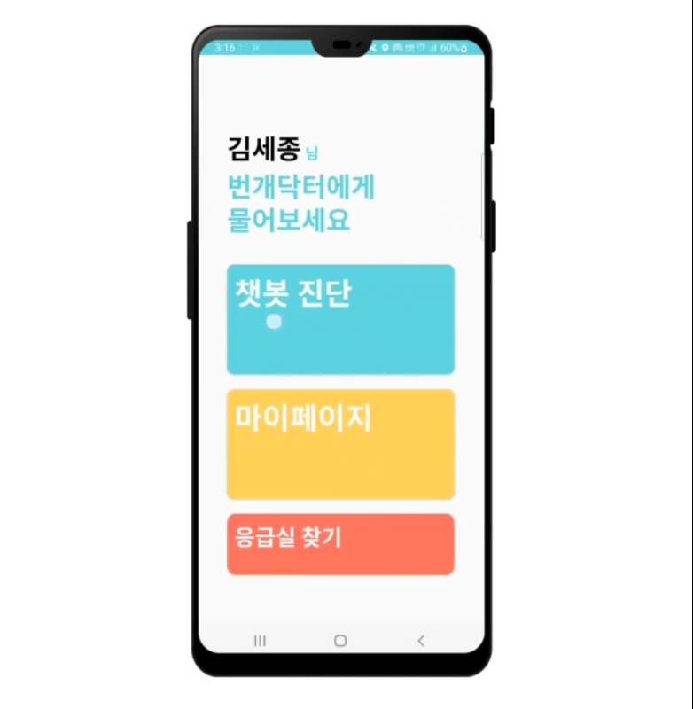
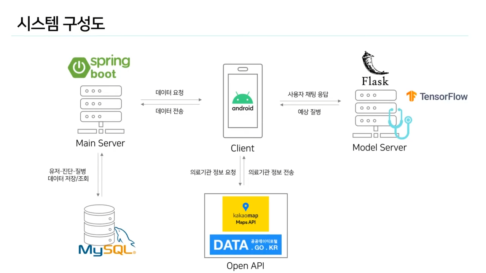
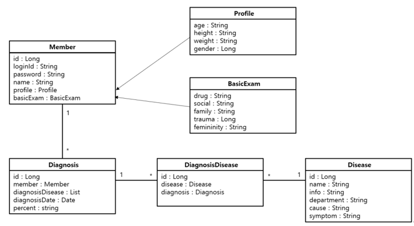
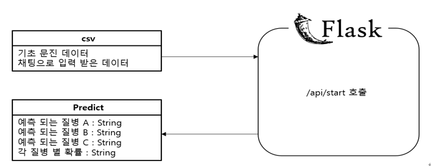
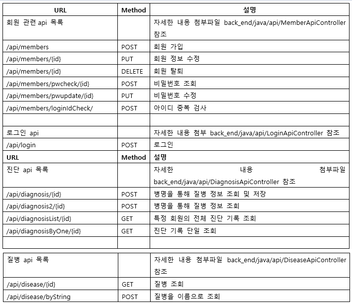
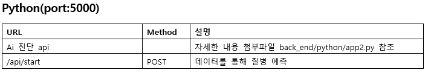

<h1> Ai-의료 챗봇 번개 닥터

<h2> 시스템 구성도

<h2> 도메인 모델 - Spring

<h2> 도메인 모델 - Flask

<h2> 기술 스택

<h3 > 공통

- IntelliJ
- PyCharm
- MySQL
- Postman
- aws ec2
  

<h3 >자바
  
- Spring boot(2.6.4)
- Spring JPA
- Lombok
- Spring web

<h3 > 파이썬

 - Flask

<h2> Api 명세서 - Spring

<h2> Api 명세서 - Flask

